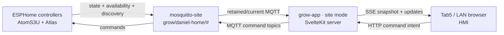

# Grow App Phase 1

Implementation plan · site-mode HMI v1

**Scope:** Build `grow-app` v1 as the LAN-local site-mode HMI/API for
Daniel's grow site. **Framework:** SvelteKit + Svelte 5 + TypeScript.
**Broker:** Daniel's site Mosquitto at `grow/daniel-home/#`.
**Status:** <span class="badge badge-info">ready to implement</span>

## Outcome

Phase 1 proves the local control path end to end:



The browser never connects directly to Mosquitto. `grow-app` owns one
server-side MQTT session, derives the entity model from retained discovery, and
mediates all reads and writes over HTTP/SSE.

## In Scope

- Scaffold `/home/daniel/dev/grow-app` as SvelteKit, Svelte 5, TypeScript, and
  `@sveltejs/adapter-node`.
- Pin package-manager metadata to `pnpm@11.5.3` and commit `pnpm-lock.yaml`.
- Lift the Svelte 5 guardrail from the grow-control brief into
  `grow-app/AGENTS.md`.
- Enable ESPHome MQTT discovery for AtomS3U and Atlas under the site-scoped
  prefix `grow/daniel-home/_discovery`.
- Add a site broker user `grow-app-site-daniel-home`, backed by
  `MQTT_GROW_APP_SITE_PASSWORD`, with `readwrite grow/daniel-home/#`.
- Build the local HMI first screen: broker/site health, device availability,
  device cards, live values, and writable controls.
- Expose all discovered writable controls that have MQTT command topics.
- Require explicit confirmation before publishing dangerous or momentary actions
  such as restart, calibration, clear calibration, and factory reset.

## Out of Scope

- Central mode and `grow.dephekt.net`.
- Keycloak/OIDC, multi-site tenancy, and remote user authorization.
- InfluxDB/history.
- AC Infinity and Pulse bridges.
- `grow-rules`.
- Retained app command publishes. Phase 1 command publishes are not retained;
  retained setpoint semantics are revisited when setpoints are separated from
  momentary actions.

## MQTT Contract

Site mode uses these defaults:

| Setting | Value |
|---|---|
| Site | `daniel-home` |
| State namespace | `grow/daniel-home/#` |
| Discovery prefix | `grow/daniel-home/_discovery` |
| App broker user | `grow-app-site-daniel-home` |
| App password secret | `MQTT_GROW_APP_SITE_PASSWORD` |

Server responsibilities:

1. Subscribe to `grow/daniel-home/#`.
2. Parse retained ESPHome/Home Assistant MQTT discovery payloads under
   `grow/daniel-home/_discovery/#`.
3. Cache entity metadata, retained/current state, and device availability.
4. Stream snapshots and updates to browsers over SSE.
5. Publish command requests only to discovered command topics.

Public local interfaces:

| Method | Path | Purpose |
|---|---|---|
| `GET` | `/health` | Broker/app liveness for local deploy checks |
| `GET` | `/api/snapshot` | Current broker, device, entity, and state cache |
| `GET` | `/api/events` | SSE stream for snapshot/update events |
| `POST` | `/api/entities/:entityId/command` | Mediated writes to command topics |

## UI Requirements

The first route is the HMI, not a landing page. It should fit a Tab5 kiosk and
LAN phones while remaining usable on desktop:

- Status strip for site, broker connection, last update, and entity/device
  counts.
- Device cards grouped by discovery device metadata.
- Live value rows for sensors and binary sensors.
- Writable controls for `switch`, `number`, `select`, `button`, and other
  discovered command-topic entities.
- Offline/stale states visible without hiding the last known value.
- Confirmation before dangerous actions. The server should also require a
  confirmation flag for entities classified as dangerous.

## Verification

Docs:

```bash
mkdocs build --strict
```

ESPHome/MQTT:

```bash
./docker/esphome compile configs/test-atoms3u-sensors.yaml
./docker/esphome compile configs/atlas-hydro-kit.yaml
```

Expected broker observations after flashing or restart:

- Discovery appears under `grow/daniel-home/_discovery/#`.
- Live state and status remain under `grow/daniel-home/#`.

App:

```bash
pnpm install --frozen-lockfile
pnpm check
pnpm test
pnpm build
pnpm test:e2e
```

Acceptance:

- App loads on LAN without Keycloak.
- AtomS3U and Atlas appear from discovery.
- Retained state renders immediately on load.
- SSE updates live values without a page refresh.
- Writable controls publish to the discovered MQTT command topics.
- Dangerous actions publish only after explicit confirmation.
