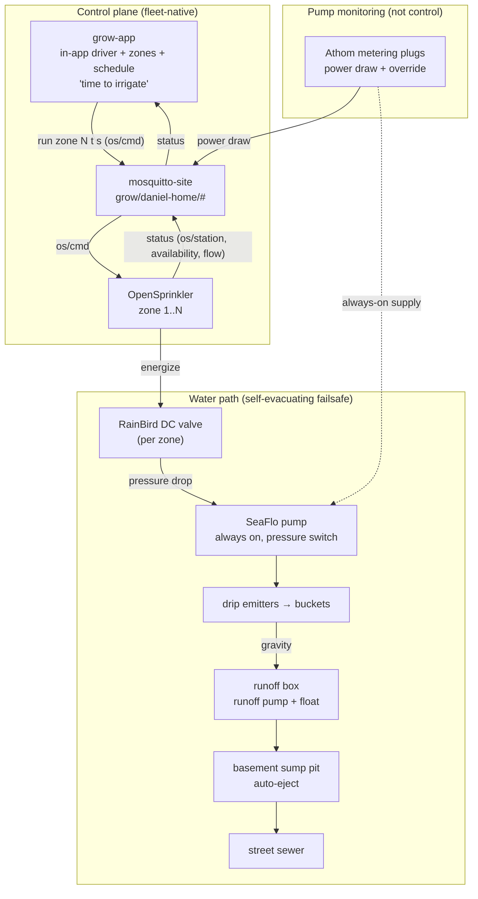

# Irrigation Control

Design brief · OpenSprinkler-valve irrigation with always-on pumps

**Scope:** Let grow-app run irrigation as a timed pulse ("pressurize the emitters for
N minutes") by **opening an OpenSprinkler-driven valve**, not by switching the pump.
The **SeaFlo pump is always powered** and self-actuates on its own pressure switch; the
**RainBird DC valve on OpenSprinkler zone 1** is the real actuator. Smart plugs on the
pumps provide **power-draw monitoring + a manual override**, not irrigation control.
**Status:**
approach pinned (OpenSprinkler-centric, in-app driver)
phase 1 scheduled — grow-app #50
crop steering deferred

## About this document

!!! note ""
    Self-contained design brief. A downstream implementation agent (or future-me)
    should be able to build the irrigation integration from this without recovering
    context from chat. Establishes context → pins decisions → shows the topology →
    tracks open threads.

    Related: [Grow control system](grow-control-system.md) ·
    [Grow app Phase 1](grow-app-phase-1.md) ·
    [Reference climate node](reference-climate-node.md).

## Status snapshot

!!! note ""
    **Decisions pinned:** 9  ·  **Open threads:** 2 (3 resolved 2026-07)  ·  **Deferred / out of scope:** 3

    **Update (2026-07):** OpenSprinkler is now on the site MQTT bus (media-stack PR #15) —
    it publishes status under `grow/daniel-home/os/#` and accepts zone-run commands over
    MQTT (`os/cmd`), so **open threads #1 (control path) and #4 (bridge home) are resolved**:
    the integration is a **thin in-app driver inside grow-app**, not a standalone bridge,
    and control rides MQTT (no HTTP path). First ship is split into **manual control
    (grow-app #50, scheduled)** and a **time schedule (grow-app #51)** under epic #32; the
    irrigation *model* is now grounded in the CCI Black Book crop-steering chapter (see §8).

    **Superseded (2026-07):** the earlier design had grow-app *pulse the SeaFlo pump*
    via an ESPHome smart plug ("Irrigate Now" → pump relay for 60 s). That was wrong for
    the real rig. The pump is **always on** with a built-in **pressure switch**;
    irrigation is gated by a **RainBird valve wired to OpenSprinkler zone 1**. Opening
    the valve drops line pressure → the pump auto-runs → emitters pressurize; closing it
    lets pressure ramp back up → the pump idles. So grow-app actuates **the OpenSprinkler
    valve**, and the pump plugs become **monitoring + override**.

------------------------------------------------------------------------

## 1. Goal & context

grow-app needs to actuate irrigation: *"it's time to irrigate → pressurize the emitters
for N minutes."* On the real rig that means **open the OpenSprinkler valve for N
minutes, then close it** — the pump follows automatically:

1. OpenSprinkler energizes **zone 1** → the **RainBird DC valve** opens.
2. Line pressure drops → the **SeaFlo pump's pressure switch** turns the pump on.
3. The pump draws from the reservoir and pressurizes the drip line → emitters flow.
4. Cycle ends → OpenSprinkler de-energizes the zone → valve closes → pressure ramps back
   up → the pump's pressure switch idles it → emitters offline.

So under normal operation **the pumps are always powered** (they self-cycle on pressure)
and **OpenSprinkler owns the on/off**. grow-app (and later grow-rules) owns the *"when"*
— replacing HA/manual scheduling — but it actuates through OpenSprinkler, never by
switching the pump.

**Flooding is not the risk it first appears.** The water path is self-evacuating:

- plant buckets drain by **gravity** to a runoff box;
- the runoff box has a **runoff pump on its own float switch** (always powered) that
  auto-pumps to the basement **sump pit**;
- the sump pit auto-ejects to the street sewer when full.

So a valve stuck open overflows into a path that drains itself. The realistic worst case
is **wasted nutrient solution (~27 gal, one full reservoir)** — a cost/waste problem, not
a flood. Safeguards (a max-run cap on the zone) are sized to *"don't dump the tank,"* not
*"prevent catastrophe."*

## 2. Decisions pinned

| # | Decision | Rationale |
|---|---|---|
| 1 | **The OpenSprinkler valve is the irrigation actuator, not the pump.** | The SeaFlo pump is always powered and self-actuates on a pressure switch. Opening the RainBird valve (OpenSprinkler zone) drops pressure and the pump follows. grow-app commands the *valve*, never the pump relay. **Supersedes the old "pulse the pump plug" design.** |
| 2 | **Pumps stay always-on; smart plugs = monitoring + manual override.** | The SeaFlo and runoff pumps run on their own pressure/float switches. The Athom metering plugs give **power-draw telemetry** (history + a failsafe signal) and a **manual override kill** for maintenance/failsafe — not irrigation timing. |
| 3 | **Integrate OpenSprinkler into the grow entity model via a thin normalizer.** | OS is not an ESPHome device, so it needs a small normalizer to appear as curated zones. **Resolved 2026-07:** OS is on the site MQTT bus (PR #15) and accepts zone-run commands over `os/cmd`, so **both status and control ride MQTT** (no HTTP path) — and, unlike the AC Infinity / Pulse bridges (standalone because those devices aren't on MQTT), this lives as an **in-app driver module inside grow-app** (decision #8). |
| 4 | **Model 2–4 independently-triggerable zones up front.** | OpenSprinkler drives one valve per tent; design the zone entity/UI model for a handful of zones now (not hard-coded to one), generalizing to the full controller later. |
| 5 | **First ship = manual + time schedule (now split into two phases).** | App can **run zone N for X minutes** on demand (then auto-stop), plus a simple **time-based schedule** (N cycles/day). **Refined 2026-07:** shipped as two sequenced phases — **manual (#50)** then **schedule (#51)**. Sensor-driven irrigation is a later, deferred phase. |
| 6 | **Max-run watchdog on the zone.** | A per-zone absolute max-on (OpenSprinkler station max-run, and/or a bridge-side cap) bounds a stuck-open valve to *"don't dump the tank."* The self-evacuating drainage covers the rest. |
| 7 | **grow-app / grow-rules owns the "when."** | The irrigation decision (schedule now; later VWC / EC / dryback crop-steering) is app/rules logic, replacing HA automations per the [control-system brief](grow-control-system.md). |
| 8 | **The OpenSprinkler driver lives in-app, not as a standalone bridge.** | Resolves open thread #4. grow-app-site already holds readwrite on `grow/daniel-home/#` and OS is already on MQTT, so the normalizer + command translator is a module inside grow-app behind a thin `IrrigationController` interface — no extra container or MQTT user. A standalone bridge (AC Infinity / Pulse style) is only warranted for devices that aren't natively on the bus; the interface keeps a later extraction cheap if a second controller type appears. |
| 9 | **A "shot" is modeled as % of substrate volume / mL / seconds, interconverted.** | Enriches decision #4. Per the CCI Black Book (p.55), `duration = shot% × substrate_vol ÷ (drippers × emitter mL/min)`, so a **zone** stores substrate type + volume + dripper count + emitter flow and shots can be entered in grower-native units — keeping v1 control aligned with crop-steering vocabulary (§8) without building the automation yet. |

## 3. System topology

**Plumbing chain (reservoir → emitters):** 27 gal HDX tote → ½" NPT bulkhead → manual
shutoff valve (normally open) → cam fittings → ¾" tubing → **SeaFlo pump** (always on,
pressure switch) → **RainBird DC valve** (wired to OpenSprinkler zone 1) → drip line →
emitters.

## 4. Two moving parts

### 4a. OpenSprinkler (the actuator — new work)

- **Control (MQTT, in-app driver):** a driver module in grow-app publishes
  `cm?pw=<md5(device pw)>&sid=N&t=D&en=1` (stop = `t=0` / `cv`) to
  `grow/daniel-home/os/cmd`; OS subscribes and runs the station for `D` seconds,
  enforcing its own station timer. No HTTP path.
- **Status → entities:** the driver normalizes OS's `os/station/<n>`, `os/availability`
  and `os/sensor/flow` and **self-publishes retained HA-discovery** for them, so zones
  ride the existing discovery → entity → snapshot/SSE + recorder→InfluxDB pipeline like
  any other curated device — no recorder change.
- **App surface:** a dedicated **Irrigation panel** — per zone a **run-a-shot** action
  (enter % / mL / seconds, interconverted via the zone's substrate + emitter spec) with
  run/stop, plus live on/off + last-run. A **per-zone max-run watchdog** (decision #6)
  bounds a stuck valve.
- **Schedule:** a simple time-based schedule (cycles/day) lives in grow-app (phase #51),
  not on OS, so the "when" stays in the app layer.

!!! success "OS MQTT command support — confirmed (2026-07)"
    The installed firmware **accepts zone-run commands over MQTT**: the OpenSprinkler
    *Subscribe Topic* (`grow/daniel-home/os/cmd`) takes HTTP-API command strings with
    `pw=<md5(device password)>`. So the integration is a thin **in-app status normalizer +
    command translator**, not an HTTP bridge (resolves open thread #1). The device password
    is a grow secret (`GROW_OS_DEVICE_PASSWORD`), MD5'd at runtime.

### 4b. Pump smart plugs (monitoring + override — reframed)

- **Devices:** Athom pre-flashed ESPHome US plugs (ESP8285, HLW8032 power metering) on
  the SeaFlo pump supply and (optionally) the runoff pump. `devices/irrigation-pump.yaml`
  and `devices/runoff-monitor.yaml` already exist; they join the fleet via MQTT discovery.
- **Always on:** the relay stays **ON** (the pumps self-cycle on their pressure/float
  switches). Expose **Pump Power** (draw) as a metric + the plug **state**, plus a
  **manual override** switch to cut power for maintenance or as a failsafe.
- **Failsafe signal (future rule, not built now):** correlate *valve open* with *pump
  draw*. Valve open but **no pump draw in the expected range** ⇒ the pump isn't running
  (dead pump, stuck pressure switch, tripped supply) — a fault worth alerting on. Runoff
  power without a preceding irrigation pulse ⇒ a likely leak. Building the anomaly logic
  is out of scope; the point of this phase is to land the **monitoring + override
  primitives** so it's possible later.

## 5. Control logic (grow-app / grow-rules)

The "when" stays in the app layer, never HA. Tracked as epic #32 with three phases:

- **Phase 1 — manual (grow-app #50, scheduled):** run a zone as a timed **shot**
  (%/mL/seconds) on demand, then auto-stop; the zone model + driver + max-run watchdog.
- **Phase 2 — schedule (grow-app #51):** a simple per-zone time schedule (cycles/day) —
  the first always-on server scheduler in grow-app.
- **Phase 3 — crop steering (deferred):** VWC / EC / dryback-target-driven cycles run by
  the grow-rules engine (#29) from substrate sensing (#26). This is where the pump-power
  failsafe and closed-loop runoff confirmation live. **Do not design this until we're
  ready to flesh out and ship crop steering.** The model to build it from is captured in §8.

## 6. Verification

1. **Zone run:** trigger "run zone 1 for 1 min" in grow-app → OpenSprinkler opens the
   valve, **Pump Power** shows draw, emitters flow; at 1 min the zone closes and pump
   draw drops.
2. **Max-run watchdog:** start a zone and let it exceed the cap → OS/bridge force-closes
   it at the station max-run.
3. **Schedule:** a scheduled cycle fires the zone at the configured time and auto-stops.
4. **Override:** toggle the pump plug override off → pump supply cut (draw → 0) even with
   a zone open; toggle back on → normal.
5. **Monitoring/history:** pump power is recorded to InfluxDB; "pump ran" is derivable
   from the draw trace for a completed cycle.
6. **Closed loop (sanity):** irrigation is followed by runoff (gravity → runoff pump
   cycles); runoff-plug telemetry, if fitted, shows the expected follow-on draw.

## 7. Open threads & deferred

!!! success "Resolved (2026-07)"
    1.  **OS control path** — OS accepts zone-run commands over MQTT (`os/cmd`); control
        rides MQTT, no HTTP. The integration is a thin normalizer + translator.
    3.  **Where scheduling lives** — grow-app (phase #51), never HA.
    4.  **Bridge home** — an **in-app driver module inside grow-app**, not a standalone
        service (OS is already on the bus; decision #8).

!!! warning "Open threads"
    2.  **Zone entity model + UI** — decided in shape (a dedicated **Irrigation panel**;
        zones store substrate + emitter + station; shots in %/mL/seconds); final 2–4-zone
        layout settled during #50.
    5.  **Runoff-pump plug** — fit the second metering plug for closed-loop confirmation +
        leak detection, or defer.

!!! note "Deferred / out of scope"
    - **Crop steering** — VWC / EC / dryback-driven irrigation via grow-rules; depends on
      substrate sensing (TEROS-12, parts-gated) and the grow-rules engine. The
      OpenSprinkler control epic is the actuator those later feed.
    - **DC switching migration** — eventually move the pump/valve to direct DC switching
      (ESP32 + relay/MOSFET) for a silent, contactless, lower-latency actuator. Not now.
    - **grow-rules engine** itself.

!!! info "Risk framing"
    Worst case from a stuck-open valve is **~27 gal of wasted nutrient solution**, not a
    flood — the runoff box (float-switched pump) → sump → sewer path evacuates overflow
    automatically. The zone max-run cap exists to avoid that waste, not to prevent
    property damage.

## 8. Crop-steering model (reference for the deferred phase 3)

Source: **CCI Black Book, Ch. 1.1 "Crop Steering," pp. 47–79** (AROYA/Grodan vocabulary).
Captured here so phase 3 can be built without re-deriving it. **Not a build spec** — do
not implement until crop steering is scheduled; the book's own stance is *"crop steering is
not automation, it's an active process."*

- **Steering directions (master lever table, p.72).** Vegetative ⇐ lower EC, higher VWC,
  more-frequent smaller shots, smaller dryback. Generative ⇐ higher EC, lower VWC,
  fewer/larger shots, bigger dryback.
- **Irrigation day = P1 / P2 / P3** (Grodan; there is no "P0"):
    - **P1 Rehydration / Ramp-Up** — first shot → field capacity; runoff by the 3rd–4th
      shot (flushes pwEC down).
    - **P2 Maintenance** — hold VWC at field capacity; shot size ≈ intershot dryback.
      Generative days often skip P2.
    - **P3 Dryback (overnight)** — last shot → lights-off → first shot next day; VWC falls,
      pwEC stacks; no night watering. Dryback magnitude is set by the last-shot-to-lights-off
      gap + next morning's start.
- **Shot math (p.55 — decision #9):** `shot_mL = shot% × substrate_vol`;
  `duration_s = shot_mL ÷ (drippers × emitter_mL_per_min) × 60` (per-dripper flow ≈
  19 / 32 / 63 mL·min⁻¹ at .3 / .5 / 1.0 GPH). Zone stores substrate type + volume,
  dripper count, emitter GPH.
- **Typical setpoints:** shot size 2–4% (veg) / 4–10% (gen); interval 15–40 min /
  40–120 min; overnight dryback 10–20% / 25–50%. Field capacity ≈ 60–75% (rockwool),
  45–75% (coco).
- **Weekly recipe (pp.56–59):** a program is a list of weeks, each a development phase
  (Veg Growth → Generative Setting → Veg Bulking → Generative/Ripe) carrying setpoints
  parameterized by substrate (rockwool/coco) and light (LED/HPS): field capacity, min WC,
  P3 dryback, drip EC, substrate-EC band.
- **Feedback boundary (p.76):** VWC + pwEC come from in-container probes, but **runoff
  volume, pH and EC are manual log inputs** (sensors can't see them) — the model needs a
  manual runoff log. Closed-loop rules to encode later: stop P1 at field capacity + runoff
  started; give a P2 shot when intershot dryback ≥ target; control P3 via last-shot timing.
  The pp.74–75 adjustment matrix (dryback × EC × mode → start-time / #-shots / shot-size /
  window / runoff deltas) is a built-in "how do I fix X?" advisor.

**Feeds:** grow-rules (#29) for the decision logic, substrate sensing (#26) for VWC/pwEC.
