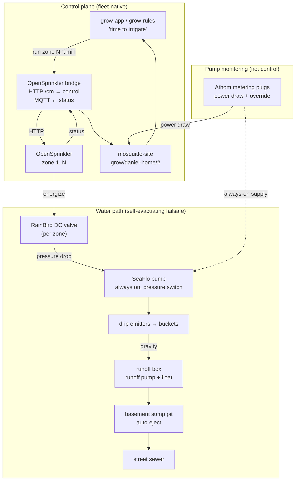

# Irrigation Control

Design brief · OpenSprinkler-valve irrigation with always-on pumps

**Scope:** Let grow-app run irrigation as a timed pulse ("pressurize the emitters for
N minutes") by **opening an OpenSprinkler-driven valve**, not by switching the pump.
The **SeaFlo pump is always powered** and self-actuates on its own pressure switch; the
**RainBird DC valve on OpenSprinkler zone 1** is the real actuator. Smart plugs on the
pumps provide **power-draw monitoring + a manual override**, not irrigation control.
**Status:**
approach re-pinned (OpenSprinkler-centric)
build deferred

## About this document

!!! note ""
    Self-contained design brief. A downstream implementation agent (or future-me)
    should be able to build the irrigation integration from this without recovering
    context from chat. Establishes context → pins decisions → shows the topology →
    tracks open threads.

    Related: [Grow control system](grow-control-system.md) ·
    [Grow app Phase 1](grow-app-phase-1.md) ·
    [Reference climate node](reference-climate-node.md).

## Status snapshot

!!! note ""
    **Decisions pinned:** 7  ·  **Open threads:** 5  ·  **Deferred / out of scope:** 3

    **Superseded (2026-07):** the earlier design had grow-app *pulse the SeaFlo pump*
    via an ESPHome smart plug ("Irrigate Now" → pump relay for 60 s). That was wrong for
    the real rig. The pump is **always on** with a built-in **pressure switch**;
    irrigation is gated by a **RainBird valve wired to OpenSprinkler zone 1**. Opening
    the valve drops line pressure → the pump auto-runs → emitters pressurize; closing it
    lets pressure ramp back up → the pump idles. So grow-app actuates **the OpenSprinkler
    valve**, and the pump plugs become **monitoring + override**. **Build not started** —
    this is the pickup point.

------------------------------------------------------------------------

## 1. Goal & context

grow-app needs to actuate irrigation: *"it's time to irrigate → pressurize the emitters
for N minutes."* On the real rig that means **open the OpenSprinkler valve for N
minutes, then close it** — the pump follows automatically:

1. OpenSprinkler energizes **zone 1** → the **RainBird DC valve** opens.
2. Line pressure drops → the **SeaFlo pump's pressure switch** turns the pump on.
3. The pump draws from the reservoir and pressurizes the drip line → emitters flow.
4. Cycle ends → OpenSprinkler de-energizes the zone → valve closes → pressure ramps back
   up → the pump's pressure switch idles it → emitters offline.

So under normal operation **the pumps are always powered** (they self-cycle on pressure)
and **OpenSprinkler owns the on/off**. grow-app (and later grow-rules) owns the *"when"*
— replacing HA/manual scheduling — but it actuates through OpenSprinkler, never by
switching the pump.

**Flooding is not the risk it first appears.** The water path is self-evacuating:

- plant buckets drain by **gravity** to a runoff box;
- the runoff box has a **runoff pump on its own float switch** (always powered) that
  auto-pumps to the basement **sump pit**;
- the sump pit auto-ejects to the street sewer when full.

So a valve stuck open overflows into a path that drains itself. The realistic worst case
is **wasted nutrient solution (~27 gal, one full reservoir)** — a cost/waste problem, not
a flood. Safeguards (a max-run cap on the zone) are sized to *"don't dump the tank,"* not
*"prevent catastrophe."*

## 2. Decisions pinned

| # | Decision | Rationale |
|---|---|---|
| 1 | **The OpenSprinkler valve is the irrigation actuator, not the pump.** | The SeaFlo pump is always powered and self-actuates on a pressure switch. Opening the RainBird valve (OpenSprinkler zone) drops pressure and the pump follows. grow-app commands the *valve*, never the pump relay. **Supersedes the old "pulse the pump plug" design.** |
| 2 | **Pumps stay always-on; smart plugs = monitoring + manual override.** | The SeaFlo and runoff pumps run on their own pressure/float switches. The Athom metering plugs give **power-draw telemetry** (history + a failsafe signal) and a **manual override kill** for maintenance/failsafe — not irrigation timing. |
| 3 | **Integrate OpenSprinkler as a bridge into the MQTT entity model.** | OS is not an ESPHome device. A small bridge maps each OS zone to grow-app's entity model — control via OS's **HTTP/JSON API** (`/cm?...` to run a station for a set time), status consumed over **MQTT** where OS publishes it. Same pattern as the planned **AC Infinity** and **Pulse** bridges. |
| 4 | **Model 2–4 independently-triggerable zones up front.** | OpenSprinkler drives one valve per tent; design the zone entity/UI model for a handful of zones now (not hard-coded to one), generalizing to the full controller later. |
| 5 | **First ship = manual + time schedule.** | App can **run zone N for X minutes** on demand (then auto-stop), plus a simple **time-based schedule** (e.g. N cycles/day). Sensor-driven irrigation is a later phase. |
| 6 | **Max-run watchdog on the zone.** | A per-zone absolute max-on (OpenSprinkler station max-run, and/or a bridge-side cap) bounds a stuck-open valve to *"don't dump the tank."* The self-evacuating drainage covers the rest. |
| 7 | **grow-app / grow-rules owns the "when."** | The irrigation decision (schedule now; later VWC / EC / dryback crop-steering) is app/rules logic, replacing HA automations per the [control-system brief](grow-control-system.md). |

## 3. System topology

**Plumbing chain (reservoir → emitters):** 27 gal HDX tote → ½" NPT bulkhead → manual
shutoff valve (normally open) → cam fittings → ¾" tubing → **SeaFlo pump** (always on,
pressure switch) → **RainBird DC valve** (wired to OpenSprinkler zone 1) → drip line →
emitters.

## 4. Two moving parts

### 4a. OpenSprinkler (the actuator — new work)

- **Control:** grow-app tells the bridge *"run zone N for t minutes"*; the bridge calls
  OpenSprinkler's HTTP API to start/stop that station. OS enforces its own station
  timer; the bridge sets/relays the duration.
- **Status → MQTT:** consume OS's zone state (on/off, remaining, last-run) and republish
  it into `grow/daniel-home/...` so grow-app renders zones like any other curated entity.
- **App surface:** each zone as a curated control — a **run-for-duration** action
  (duration `number` + run/stop) and a **state** readout. Placement (dashboard
  quick-control vs a dedicated Irrigation panel) is TBD.
- **Schedule:** a simple time-based schedule (cycles/day) lives in grow-app / grow-rules,
  not on OS, so the "when" stays in the app layer.

!!! warning "Verify OS's MQTT command support"
    Historically OpenSprinkler **publishes** events/status over MQTT but is **controlled**
    via its HTTP JSON API — hence the bridge. Confirm the installed firmware's MQTT
    capabilities; if it accepts zone-run commands over MQTT directly, the bridge shrinks
    to a thin status normalizer. Either way the app-facing contract is the same.

### 4b. Pump smart plugs (monitoring + override — reframed)

- **Devices:** Athom pre-flashed ESPHome US plugs (ESP8285, HLW8032 power metering) on
  the SeaFlo pump supply and (optionally) the runoff pump. `devices/irrigation-pump.yaml`
  and `devices/runoff-monitor.yaml` already exist; they join the fleet via MQTT discovery.
- **Always on:** the relay stays **ON** (the pumps self-cycle on their pressure/float
  switches). Expose **Pump Power** (draw) as a metric + the plug **state**, plus a
  **manual override** switch to cut power for maintenance or as a failsafe.
- **Failsafe signal (future rule, not built now):** correlate *valve open* with *pump
  draw*. Valve open but **no pump draw in the expected range** ⇒ the pump isn't running
  (dead pump, stuck pressure switch, tripped supply) — a fault worth alerting on. Runoff
  power without a preceding irrigation pulse ⇒ a likely leak. Building the anomaly logic
  is out of scope; the point of this phase is to land the **monitoring + override
  primitives** so it's possible later.

## 5. Control logic (grow-app / grow-rules)

The "when" stays in the app layer, never HA:

- **Now:** a manual "run zone N for X min" action in grow-app, plus a simple time
  schedule (cycles/day) per zone.
- **Later (crop steering — deferred):** VWC / EC / dryback-target-driven cycles from a
  substrate sensor, run by the grow-rules engine. This is where the pump-power failsafe
  and closed-loop runoff confirmation live. **Do not design this until we're ready to
  flesh out and ship crop steering** — it depends on substrate sensing and grow-rules.

## 6. Verification

1. **Zone run:** trigger "run zone 1 for 1 min" in grow-app → OpenSprinkler opens the
   valve, **Pump Power** shows draw, emitters flow; at 1 min the zone closes and pump
   draw drops.
2. **Max-run watchdog:** start a zone and let it exceed the cap → OS/bridge force-closes
   it at the station max-run.
3. **Schedule:** a scheduled cycle fires the zone at the configured time and auto-stops.
4. **Override:** toggle the pump plug override off → pump supply cut (draw → 0) even with
   a zone open; toggle back on → normal.
5. **Monitoring/history:** pump power is recorded to InfluxDB; "pump ran" is derivable
   from the draw trace for a completed cycle.
6. **Closed loop (sanity):** irrigation is followed by runoff (gravity → runoff pump
   cycles); runoff-plug telemetry, if fitted, shows the expected follow-on draw.

## 7. Open threads & deferred

!!! warning "Open threads"
    1.  **OS control path** — confirm firmware MQTT command support vs HTTP-API-only;
        size the bridge accordingly.
    2.  **Zone entity model + UI** — how a "run-for-duration" zone renders (dashboard
        quick-control vs a dedicated Irrigation panel), and how 2–4 zones are laid out.
    3.  **Where scheduling lives** — grow-app cron now vs a future grow-rules engine.
    4.  **Bridge home** — a standalone service in media-stack (like the AC Infinity /
        Pulse bridges) vs a server-side module inside grow-app.
    5.  **Runoff-pump plug** — fit the second metering plug for closed-loop confirmation +
        leak detection, or defer.

!!! note "Deferred / out of scope"
    - **Crop steering** — VWC / EC / dryback-driven irrigation via grow-rules; depends on
      substrate sensing (TEROS-12, parts-gated) and the grow-rules engine. The
      OpenSprinkler control epic is the actuator those later feed.
    - **DC switching migration** — eventually move the pump/valve to direct DC switching
      (ESP32 + relay/MOSFET) for a silent, contactless, lower-latency actuator. Not now.
    - **grow-rules engine** itself.

!!! info "Risk framing"
    Worst case from a stuck-open valve is **~27 gal of wasted nutrient solution**, not a
    flood — the runoff box (float-switched pump) → sump → sewer path evacuates overflow
    automatically. The zone max-run cap exists to avoid that waste, not to prevent
    property damage.
