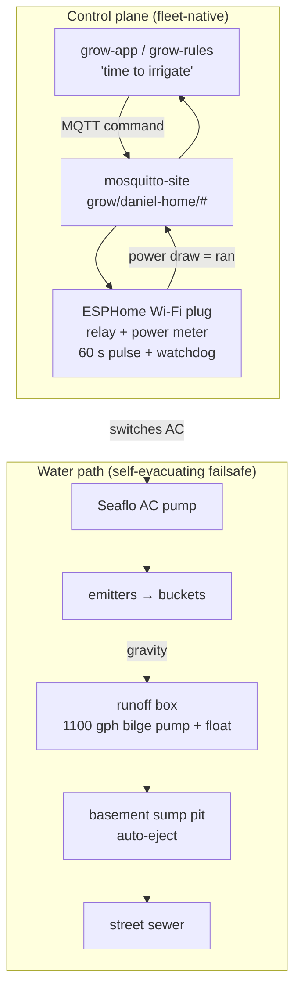

# Irrigation Control

Design brief · fleet-native pump actuation for timed irrigation

**Scope:** Let grow-app drive the **Seaflo irrigation pump** as a timed pulse
("pressurize the emitters for 60 s"), as a fleet-native MQTT actuator — replacing
Home-Assistant/Matter control. **Actuator:** ESPHome-flashable Wi-Fi smart plug.
**Pump:** AC (mains). **Status:**
<span class="badge badge-decided">approach pinned</span>
<span class="badge badge-deferred">build deferred</span>

## About this document

!!! note ""
    Self-contained design brief. A downstream implementation agent (or future-me)
    should be able to build the irrigation actuator from this without recovering
    context from chat. Establishes context → pins decisions → shows the topology →
    tracks open threads.

    Related: [Grow control system](grow-control-system.md) ·
    [Grow app Phase 1](grow-app-phase-1.md) ·
    [Reference climate node](reference-climate-node.md).

## Status snapshot

!!! note ""
    **Decisions pinned:** 6  ·  **Open threads:** 4  ·  **Deferred / out of scope:** 4

    The Seaflo irrigation pump moves from an Eve Energy (Matter/Thread) plug onto an
    **ESPHome-flashable Wi-Fi plug** that joins the MQTT fleet directly. The plug's
    relay is exposed as a `switch`; the 60 s pulse and a hard max-on watchdog are
    enforced **on the device**, so a lost command can't drain the reservoir. grow-app
    (and later grow-rules) owns the "when." **Build not started** — this is the
    pickup point.

------------------------------------------------------------------------

## 1. Goal & context

grow-app needs to actuate irrigation: *"it's time to irrigate → power the Seaflo
pump for ~60 s so the emitters pressurize."* The pump is currently on an **Eve Energy
(Matter over Thread)** plug controlled in Home Assistant.

Eve/Matter was rejected as the control path (see [§ rationale](#2-decisions-pinned)):
it would keep HA or a self-hosted Matter controller + Thread border router in the
**critical path**, which the [grow control system](grow-control-system.md) brief
explicitly forbids, and it offers no local failsafe. Both pumps are **AC**, so a
mains smart plug switches the pump cord directly — a clean drop-in for the Eve.

**Flooding is not the risk it first appears.** The water path is self-evacuating:

- plant buckets drain by **gravity** to a runoff box;
- the runoff box has an **AC bilge pump (1100 gph) on its own float switch** that
  auto-pumps to the basement **sump pit**;
- the sump pit auto-ejects to the street sewer when full.

So a pump accidentally left running overflows into a path that drains itself. The
realistic worst case is **wasted nutrient solution (~27 gal, one full reservoir)** —
a cost/waste problem, not a flood. The on-device safeguard is therefore sized to
*"don't dump the tank,"* not *"prevent catastrophe."*

## 2. Decisions pinned

| # | Decision | Rationale |
|---|---|---|
| 1 | **ESPHome-flashable Wi-Fi plug** (Athom pre-flashed ESPHome, or Shelly Plug US) | Joins the MQTT fleet directly like every other device; no Matter controller / Thread border router / HA bridge. Drop-in for the Eve since the pump is AC. |
| 2 | **Reject Eve Energy / Matter for control** | Matter-over-Thread needs a border router + a Matter controller; driving it from grow-app means HA-in-the-path (violates the control-system brief) or self-hosting `python-matter-server` + a bridge. No local failsafe either. Keep the Eve plugs for HA-side convenience loads. |
| 3 | **Timing + watchdog enforced on the device** | The 60 s pulse and an absolute max-on cap live in ESPHome, so a lost "off", app crash, or network drop can't keep the pump running. grow-app fires a one-shot; the edge self-limits. |
| 4 | **grow-app / grow-rules owns the "when"** | The irrigation decision (schedule, later VPD/substrate-moisture) is app/rules logic, replacing HA automations per the control-system brief. |
| 5 | **Reuse grow-app's existing command path** | grow-app already commands `switch`/`button`/`number` entities over MQTT with optional dangerous-action confirmation (per [Phase 1](grow-app-phase-1.md)) — **no app changes** to add the pump. |
| 6 | **Use the plug's power sensor as run-confirmation** | Athom/Shelly plugs report power; a draw spike during the pulse confirms the pump actually ran (and no-draw flags a fault). Free closed-loop telemetry. |

## 3. System topology



## 4. Bill of materials

| Part | Why | Approx |
|---|---|---|
| **Athom pre-flashed ESPHome US plug** (ESP8285, HLW8032 power metering, 16 A) — or **Shelly Plug US** (ESP32) | switches the Seaflo's AC cord; joins the fleet; reports power for run-confirmation | ~$15 |
| *(optional)* second power-metering plug on the **runoff bilge pump** | telemetry / closed-loop: confirm irrigation produced runoff; flag leaks (runoff without irrigation) | ~$15 |

!!! tip "Sizing"
    Confirm the plug's rating covers the pump's **running *and* startup (inrush)**
    current — a motor's inrush is several× its running draw. A 15/16 A plug handles a
    small irrigation pump comfortably, but check the pump's nameplate.

## 5. Firmware

The plug is its own ESPHome device. Athom ships ESPHome already; reflash it with the
fleet config (MQTT → site broker, discovery, `_firmware`/`_ui`, OTA — mirror
`atoms3u-sensor-rig.yaml`) and adopt it under `grow-fleet/devices/`. Use the plug's
ESPHome device profile (from `devices.esphome.io`) for the relay/button/LED pins.

**Safety pattern — the important part:**

```yaml
# Relay defaults OFF so a reboot/power blip never starts irrigation.
switch:
  - platform: gpio
    pin: <relay pin>          # from the plug's ESPHome device profile
    id: pump_relay
    name: "Irrigation Pump"
    restore_mode: ALWAYS_OFF
    on_turn_on:
      # Hard watchdog: absolute max on-time, even if turned on directly.
      # Must exceed the longest legitimate pulse (see number max below).
      - delay: 150s
      - switch.turn_off: pump_relay

number:
  - platform: template
    name: "Irrigation Duration"
    id: irrigation_seconds
    min_value: 5
    max_value: 120
    step: 5
    initial_value: 60
    optimistic: true
    restore_value: true

button:
  - platform: template
    name: "Irrigate Now"
    on_press:
      - script.execute: irrigate

script:
  - id: irrigate
    mode: restart              # re-trigger restarts the window
    then:
      - switch.turn_on: pump_relay
      - delay: !lambda "return id(irrigation_seconds).state * 1000;"
      - switch.turn_off: pump_relay
```

- Expose the plug's **power sensor** (`name: "Pump Power"`) for run-confirmation.
- `_ui/config`: "Irrigate Now" + "Irrigation Duration" as dashboard quick-controls;
  pump power + state as metrics.
- *Optional* abuse guard: a minimum-interval lockout (ignore re-triggers within N
  minutes) caps waste if something fires the button repeatedly.
- Marking the switch `dangerous` (browser confirm) is **optional** and probably
  unnecessary given the self-evacuating drainage — decide per taste.

## 6. Control logic (grow-app / grow-rules)

The "when" stays in the app layer, never HA:

- **Now:** a manual "Irrigate Now" button in grow-app, and/or a simple schedule.
- **Later (grow-rules):** time-of-day cycles, or sensor-driven (substrate moisture,
  VPD from the [reference climate node](reference-climate-node.md)).
- **Closed loop:** after a pulse, expect the Seaflo power spike (pump ran) and,
  shortly after, the runoff bilge pump to cycle (gravity drain). Runoff *without* a
  preceding irrigation pulse = a likely leak worth alerting on.

## 7. Verification

1. **Join:** flash the plug with the fleet config → it appears in grow-app via MQTT
   discovery (no app rebuild).
2. **Pulse:** fire "Irrigate Now" → relay clicks, **Pump Power** shows draw for ~60 s,
   then off.
3. **Watchdog:** turn `pump_relay` on directly (bypass the script) → it force-offs at
   the hard cap (~150 s).
4. **Lost network:** kill Wi-Fi mid-pulse → the device still turns the pump off (the
   script + watchdog run locally, not in the app).
5. **Reboot:** power-cycle mid-pulse → relay returns **OFF** (`restore_mode`).
6. **Closed loop:** confirm runoff follows irrigation (gravity → bilge pump cycles);
   sanity-check the optional runoff-plug telemetry if fitted.

## 8. Open threads & deferred

!!! warning "Open threads"
    1.  **Plug model + sizing** — pick Athom vs Shelly; confirm pump running + inrush
        current is within the plug's rating.
    2.  **Pulse semantics** — fixed 60 s button vs duration `number` vs scheduled vs
        moisture-triggered; pin the default.
    3.  **Where scheduling lives** — grow-app cron now vs a future grow-rules engine.
    4.  **Monitor the runoff bilge pump?** — a second power-metering plug enables
        closed-loop confirmation + leak detection; decide if it's worth the part.

!!! note "Deferred / out of scope"
    - **DC switching migration** — Daniel plans to eventually move to direct DC
      switching (ESP32 + relay/MOSFET on the pump supply) for a silent, contactless,
      lower-latency actuator. Not now — the working AC Seaflo stays.
    - **grow-rules engine** itself.
    - **Substrate-moisture-driven irrigation** (add a soil/substrate sensor later).
    - **Multi-zone valves** (one pump, multiple solenoid zones).

!!! info "Risk framing"
    Worst case from a stuck-on pump is **~27 gal of wasted nutrient solution**, not a
    flood — the runoff box (float-switched bilge pump) → sump → sewer path evacuates
    overflow automatically. The on-device watchdog exists to avoid that waste, not to
    prevent property damage.
