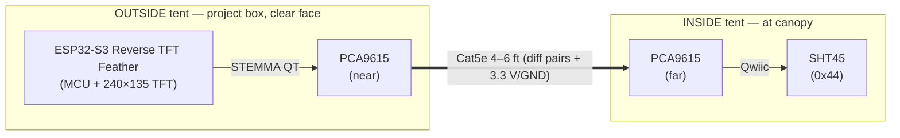

# Reference Climate Node

Design brief · hardware + firmware for the tent VPD reference

**Scope:** Add a trustworthy reference air **temperature + humidity** source to the
grow tent and compute **air VPD** and **leaf VPD** from it, as a new ESPHome device
in the existing fleet. **Sensor:** Sensirion SHT45. **Host:** Adafruit ESP32-S3
Reverse TFT Feather with an onboard readout. **Status:**
<span class="badge badge-decided">design pinned</span>
<span class="badge badge-deferred">build deferred</span>

## About this document

!!! note ""
    Self-contained design brief for the reference climate node. A downstream
    planning/implementation agent (or future-me) should be able to read this
    end-to-end and build it without recovering context from chat. It follows four
    moves:

    1.  **Establish context** — why the existing sensors can't be the reference.
    2.  **Pin decisions** — choices already made, with rationale.
    3.  **Surface the shape** — topology, BOM, wiring, firmware.
    4.  **Track open threads** — what to confirm at bring-up.

    Related: [Grow control system](grow-control-system.md) ·
    [Grow app Phase 1](grow-app-phase-1.md).

## Status snapshot

!!! note ""
    **Decisions pinned:** 6  ·  **Open threads:** 4  ·  **Deferred / out of scope:** 4

    Hardware + firmware shape agreed. A single SHT45 supplies reference temp + RH;
    a differential I²C extender puts it at the canopy with the MCU outside the tent;
    VPD (air + leaf) is computed on-device by a new reusable `vpd` component; the
    node joins the fleet over MQTT discovery so `grow-app` needs no changes.
    **Implementation is intentionally not started** — this brief is the durable
    artifact to pick up from.

------------------------------------------------------------------------

## 1. Goal & context

The temp/RH sensors on the **CO2L** (SCD41) and **AirQ** (SCD40) units self-heat
inside their packed enclosures, so their readings drift warm/dry and aren't
trustworthy as the tent's *reference* climate. VPD — and the climate dashboard —
needs a clean reference air temperature and humidity, plus the thermal camera's
average leaf temperature for a proper leaf VPD.

The original idea was Atlas Scientific reference probes (EZO Complete-TMP kit +
EZO-HUM). Two findings reshaped that:

1. The **EZO Complete-TMP is a USB instrument** — an EZO-RTD circuit on an FTDI
   UART→USB carrier (datasheet p.3). Great for a Raspberry Pi host, awkward for an
   ESP32 (ESPHome has no FTDI-host driver).
2. For a **fixed air-temp reference**, a digital sensor is *more* accurate and far
   simpler than a PT-1000 probe. A single **Sensirion SHT45** (±0.1 °C / ±1 % RH,
   NIST-traceable) on I²C covers **both** temp and humidity with a first-class
   ESPHome `sht4x` component and no custom firmware.

**Outcome:** a new ESPHome device, `reference-climate`, joins the fleet exactly like
`atlas-hydro-kit` and `atoms3u-sensor-rig` (in `/home/daniel/dev/grow-fleet/devices/`):
it publishes reference temperature, humidity, **air VPD**, and **leaf VPD** over MQTT
discovery, appears in `grow-app` automatically, and gets OTA + a web UI for free.
Self-heating is solved by *placement* — the MCU lives outside the tent and only the
µW-class SHT45 sits inside at the canopy in open air.

## 2. Decisions pinned

| # | Decision | Rationale |
|---|---|---|
| 1 | **SHT45 single chip** for reference temp **and** RH | ±0.1 °C / ±1 % RH (beats the EZO-HUM's ±2 % RH), native ESPHome `sht4x`, no custom driver. Drops the PT-1000, MAX31865, and EZO-HUM entirely. |
| 2 | **Leaf VPD computed on the node** | Subscribes to the thermal rig's ROI-mean temp over MQTT (`mqtt_subscribe`) and does the math on-device — mirrors the existing on-device VPD pattern (`scd4x_stats`) and keeps `grow-app` a pure ingest/display layer. |
| 3 | **PCA9615 differential I²C extender over Cat5e** for the 4–6 ft run | Sensor at canopy, MCU outside. Differential rejects tent fan/pump/LED-driver EMI and is good to ~30 m; transparent to ESPHome. Bare I²C/STEMMA isn't viable at that length (~1 m @ 100 kHz; single-ended open-drain picks up EMI). |
| 4 | **MCU = Adafruit ESP32-S3 Reverse TFT Feather (PID 5691)** | Onboard 240×135 ST7789 screen shows Air VPD / Leaf VPD / temp / RH at a glance; native STEMMA QT plugs straight into the near PCA9615; 3 user buttons. Lives in a clear-faced project box on the outside equipment board. |
| 5 | **New reusable `vpd` component** (not `scd4x_stats`) | `scd4x_stats` is CO2-coupled (schema *requires* `co2_sensor`). A standalone `vpd` component takes temp/RH (+ optional leaf temp) and is reusable across the fleet. |
| 6 | **`grow-app` unchanged** | It derives entities from retained MQTT discovery, so the new device appears automatically. |

## 3. Bill of materials

~$60, fully solderless.

| Part | Why | Approx |
|---|---|---|
| **Adafruit ESP32-S3 Reverse TFT Feather** (PID 5691) | MCU + onboard 240×135 TFT readout; native STEMMA QT; 4 MB flash / 2 MB PSRAM | ~$18 |
| **Adafruit SHT45** STEMMA QT breakout (PID 5665) | reference temp + RH, ±0.1 °C / ±1 % RH | ~$8 |
| **SparkFun Qwiic Differential I²C Bus Extender (PCA9615) ×2** | bridge the 4–6 ft run as differential over Cat5e; one each end | ~$22 |
| **Cat5e patch cable, 4–6 ft** | carries the differential pairs (and 3.3 V/GND) between the extenders | ~$3 |
| Qwiic/STEMMA-QT cables (2 short) | Feather↔near-extender, far-extender↔SHT45 | ~$2 |
| **Project box, clear face** + vented SHT45 mount | Feather + near extender outside (readable screen); open-air SHT45 at canopy | ~$7 |

!!! tip "Notes"
    - **Power:** Feather runs off USB-C (5 V) from the equipment board, or a LiPo.
    - **Bigger screen later:** an M5Stack CoreS3 (2.4") is already supported in
      `esphome-components` (`grow_env_monitor`, `m5cores3_*`) — but a *different*
      display stack (M5Unified); the Reverse TFT Feather is the chosen path here.
    - **The Atlas USB Complete-TMP** (if already bought) isn't wasted — keep it as a
      bench reference to spot-check the SHT45 from a laptop/Pi.

## 4. Wiring & placement



- **All-solderless:** every hop is a Qwiic/STEMMA-QT cable except the Cat5e (RJ45)
  between the two PCA9615 boards.
- The SparkFun Qwiic PCA9615 carries **3.3 V + GND over the Cat5e** alongside the
  differential pairs, so the canopy end needs **no separate power** — confirm on the
  board's RJ45 pinout.

!!! warning "TFT-power-enable also gates the STEMMA QT port"
    On the Feather, one GPIO (`TFT_I2C_POWER`) powers *both* the TFT *and* the STEMMA
    QT connector — which is how the entire remote sensor chain (near PCA9615 → Cat5e →
    far PCA9615 → SHT45) gets power. It **must be driven HIGH at boot** (`output:` +
    `on_boot` priority above I²C/display init) or you lose the screen *and* the SHT45.
    Pin is **GPIO7** per the board pinout — **verify on your unit** (some community
    configs cite GPIO21; the plain TFT Feather 5483 differs from this Reverse 5691).

- **Canonical Feather pins (confirm against Adafruit PrettyPins at bring-up):** I²C
  SDA=GPIO3, SCL=GPIO4; TFT (ST7789) CS=GPIO42, DC=GPIO40, RST=GPIO41, MOSI=GPIO35,
  SCLK=GPIO36, backlight=GPIO45; buttons D0/D1/D2 for optional screen cycling.
- **ESPHome doesn't see the extender** — it's bus-transparent: a normal `i2c:` +
  `sht4x` at 0x44. Run the bus at **100 kHz**; pull-ups live on the breakouts.
- **Placement:** mount the **far** end (PCA9615 + SHT45) at canopy height in
  representative air — out of *direct* light and not in a fan's direct blast, but in
  the moving air the plants experience. Route Cat5e out through a tent cable
  port/zipper to the **near** end + MCU outside. Keep the SHT4x internal **heater
  off** (default) for ambient readings.

## 5. Firmware

### 5.1 New reusable `vpd` component — `esphome-components/vpd/`

The existing VPD math lives in `esphome-components/scd4x_stats/scd4x_stats.cpp` but
is CO2-coupled (its schema *requires* `co2_sensor`), so it isn't reusable for a
CO2-less reference node. Add a small standalone component:

- **Inputs:** `temperature_sensor` (air, required), `humidity_sensor` (required),
  `leaf_temperature_sensor` (optional).
- **Outputs:** `air_vpd` (always), `leaf_vpd` (when a leaf temp is provided).
- **Math** (kPa; reuse the Magnus form from `scd4x_stats.cpp` `calculate_vpd_`):
    - `SVP(T) = 0.6108 · exp(17.27·T / (T + 237.3))`
    - `air_vpd  = SVP(T_air) · (1 − RH/100)`
    - `leaf_vpd = SVP(T_leaf) − SVP(T_air)·RH/100`  (reduces to `air_vpd` when T_leaf = T_air)
- **Model the Python schema** on `scd4x_stats/__init__.py` (`use_id(sensor.Sensor)`
  inputs; optional VPD sub-sensors with `unit=kPa`, `accuracy_decimals=2`,
  `state_class=measurement`).
- Pin the new commit SHA in `grow-fleet/fleet.yaml` and reference it from the device
  YAML's `external_components`.

!!! note "MVP fallback"
    A `sensor: platform: template` lambda doing the Magnus formula works for a quick
    MVP, but the component is preferred — it matches the repo's "derived metrics live
    in a component" pattern and is reusable (the atoms3u rig could later adopt it for
    a *correct* leaf VPD using the good SHT45 air values instead of the self-heating
    SCD41).

### 5.2 New device — `grow-fleet/devices/reference-climate.yaml`

Copy the established skeleton from `atoms3u-sensor-rig.yaml` (substitutions, `api:`,
dual `ota:`, `http_request`, `update:`, `wifi:`, `web_server`, and the `mqtt:` block
with `_firmware/config` + `_ui/config` retained payloads). Set
`board: adafruit_feather_esp32s3_reversetft` and `chipFamily: ESP32-S3`. Then:

```yaml
# Drive the TFT/STEMMA-QT power rail HIGH before i2c/display init — this rail
# powers the screen AND the STEMMA QT port feeding the remote SHT45 chain.
output:
  - platform: gpio
    pin: GPIO7            # TFT_I2C_POWER (verify per PrettyPins)
    id: tft_i2c_power
esphome:
  on_boot:
    priority: 800.0       # before i2c (600) / display
    then:
      - output.turn_on: tft_i2c_power

i2c:
  sda: GPIO3             # Feather STEMMA QT
  scl: GPIO4
  frequency: 100kHz
  scan: true

sensor:
  - platform: sht4x
    address: 0x44
    temperature:
      name: "Reference Temperature"
      id: ref_temp
    humidity:
      name: "Reference Humidity"
      id: ref_humidity

  # Leaf temp pulled from the thermal rig over MQTT (ROI mean = canopy proxy).
  - platform: mqtt_subscribe
    name: "Leaf Temperature"
    id: leaf_temp
    topic: grow/daniel-home/atoms3u-sensor-rig/sensor/mlx90640_roi_mean_temp/state

vpd:
  temperature_sensor: ref_temp
  humidity_sensor: ref_humidity
  leaf_temperature_sensor: leaf_temp
  air_vpd:
    name: "Air VPD"
  leaf_vpd:
    name: "Leaf VPD"
```

- `mqtt:` `topic_prefix: grow/daniel-home/reference-climate`, same broker
  (`192.168.8.3:1883`), `discovery: true`,
  `discovery_prefix: grow/daniel-home/_discovery`.
- `_ui/config`: put **Reference Temperature, Reference Humidity, Air VPD, Leaf VPD**
  in the `overview`/`metrics` dashboard group (mirror the atoms3u `_ui` entities).
- Register the device in `fleet.yaml` so CI (`.github/workflows/firmware.yml`)
  compiles/packages it.

### 5.3 On-device display — `st7789v` (in the device YAML)

Native ESPHome display rendering the four numbers the node already has. No new
component needed.

```yaml
spi:
  clk_pin: GPIO36
  mosi_pin: GPIO35

display:
  - platform: st7789v
    model: Adafruit Feather TFT   # 240×135; tune offsets at bring-up
    cs_pin: GPIO42
    dc_pin: GPIO40
    reset_pin: GPIO41
    backlight_pin: GPIO45
    update_interval: 2s
    lambda: |-
      // Big Air VPD, then Leaf VPD / Temp / RH; color vs. the alert band.
      it.printf(120, 6, id(font_lg), "%.2f kPa", id(air_vpd).state);
      it.printf(4, 70, id(font_sm), "Leaf %.2f", id(leaf_vpd).state);
      it.printf(4, 95, id(font_sm), "%.1f C  %.0f%%",
                id(ref_temp).state, id(ref_humidity).state);
```

- Needs `font:` entries (`font_lg`, `font_sm`) — standard ESPHome glyph setup.
- 240×135 panels usually need `offset_height`/`offset_width` tuning; adjust until
  aligned.
- *Optional:* buttons D0/D1/D2 (`binary_sensor: platform: gpio`) to cycle screens or
  toggle backlight; color the VPD text green/amber/red against the same thresholds
  used in `scd4x_alerts`.

### 5.4 `grow-app` — no required changes

It derives entities from retained MQTT discovery (`src/lib/server/mqtt/`); the new
device shows up automatically via the SSE/snapshot path.

## 6. Verification

1. **Bench bring-up (short cable first):** `esphome run devices/reference-climate.yaml`
   over USB with the SHT45 on a short Qwiic lead. The I²C scan must find **0x44**
   (proves the `TFT_I2C_POWER` rail came up — nothing found ⇒ that pin/priority is
   wrong); `Reference Temperature`/`Humidity` read sane.
2. **Display:** TFT shows Air VPD / Leaf VPD / temp / RH; tune `offset_*` and
   brightness; readable through the project-box face.
3. **Extended-run integrity:** insert the PCA9615 pair + full-length Cat5e, repeat
   the scan, and soak for a few minutes near running tent fans/pumps — no I²C errors
   or dropouts. (If flaky: lower bus speed / re-seat RJ45; differential should be
   solid at 6 ft.)
4. **Air VPD:** cross-check against a hand Magnus calc at the observed temp/RH
   (match to 0.01 kPa).
5. **Leaf VPD wiring:** with the thermal rig online, confirm `leaf_temp` populates
   and `leaf_vpd` computes:
   `mosquitto_sub -h 192.168.8.3 -t 'grow/daniel-home/reference-climate/#' -v`.
6. **`grow-app`:** the `reference-climate` device appears on the dashboard with the
   four reference metrics (no app rebuild).
7. **Placement/self-heat:** verify the SHT45 doesn't read warm/dry when powered near
   the canopy; reposition on the lead if it does. SHT45 is factory NIST-calibrated —
   no field cal (optionally verify RH against a 75 % NaCl salt reference).

## 7. Open threads & deferred

!!! warning "Open threads — confirm at bring-up"
    1.  **Feather GPIOs** — `TFT_I2C_POWER` (GPIO7 vs GPIO21) and ST7789 offsets
        differ between the Reverse 5691 and plain 5483; confirm against Adafruit
        PrettyPins + a known-good ESPHome config.
    2.  **Thermal ROI** — the atoms3u rig currently has `roi: enabled: false`. Enable
        and aim the ROI at the canopy so `mlx90640_roi_mean_temp` is a real leaf-temp
        proxy. Fallback topic: `.../sensor/mlx90640_mean_temp/state` (whole-frame).
    3.  **Source topic** — confirm the leaf-temp topic against the live broker:
        `mosquitto_sub -h 192.168.8.3 -t 'grow/daniel-home/atoms3u-sensor-rig/sensor/#' -v`.
    4.  **CI registration** — confirm whether `.github/workflows/firmware.yml`
        auto-discovers `devices/*.yaml` or needs an explicit matrix entry.

!!! note "Deferred / out of scope"
    - **Firmware implementation** — not started; this brief is the pickup point.
    - **`grow-app` "reference sensor" role** — an app abstraction that authoritatively
      prefers these for tent climate; nice-to-have, not MVP.
    - **Dew point output** — SHT4x doesn't emit it directly; derive later if wanted.
    - **atoms3u rig adopting the `vpd` component** for a corrected leaf VPD using the
      SHT45 air values instead of the self-heating SCD41.

!!! info "Caveat — leaf VPD precision"
    Leaf VPD is bounded by the **MLX90640**, not the SHT45 — a thermal array is
    ~±1–2 °C absolute and emissivity-dependent (leaves ≈ 0.95). Treat leaf VPD as
    indicative; air VPD is the precise one. Also, `mqtt_subscribe` state isn't
    retained, so `leaf_vpd` is blank until the thermal rig's next publish (~2 s).
